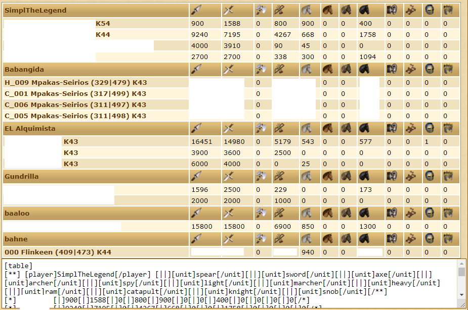

# tribalstuff

TribalWars scripts collection, developed and maintained by a complete noob, and hosted publicly at `tw.ardelian.ro`

## List of scripts

### ✅ APPROVED: Random fakes

Supports `&tribes=`, `&players=` and `&coords=` as parameters. Values separated by a space (or `%20`). For example, to send fakes to the players `majestee`, `ippe` and `Frozen99` along with everyone in the tribe `AFK` on W118, put this in your quickbar.

```javascript
javascript:$.getScript('https://tw.ardelian.ro/fakes/random?server=en118.tribalwars.net&players=majestee ippe Frozen99&tribes=AFK');
```

The resulting script that will run on the client will be something like this:

```javascript
if ($('#units_entry_all_spy').text().replace(/[^\d]/g,'')>0) $('#unit_input_spy').val(1);
if ($('#units_entry_all_catapult').text().replace(/[^\d]/g,'')>0) $('#unit_input_catapult').val(1);
else if ($('#units_entry_all_ram').text().replace(/[^\d]/g,'')>0) $('#unit_input_ram').val(1);
$('#inputx').val('415'); $('#inputy').val('450'); $('#place_target').val('415|450');
$('#target_attack').focus(); setTimeout(() => $('#content_value').css({backgroundImage: 'url(https://tw.ardelian.ro/static/stars.gif)'}), 30000);
```

Add a `&no-spy` parameter to skip the scouts and just send rams/cats, like so:

```javascript
javascript:$.getScript('https://tw.ardelian.ro/fakes/random?server=en118.tribalwars.net&no-spy&coords=123|456 111|222');
```

This script must be run on the Rally Point Commands page, it will not redirect you. The automatic redirection feature is still in development.

### ⏰ WAITING FOR APPROVAL: Support troop counter

Aggregates your support troops in each supported village and groups the villages by player.
The output is both an in-game table and a text area with BB-codes that can be copy-pasted in the forum or in the Notebook.
The BB-codes will not work in a mail, because TW mail does not support tables.

```javascript
javascript:$.getScript('https://tw.ardelian.ro/support-counter');
```

If you are not on the Troops Support page, you will be redirected there and you will need to click the script again.

The result will be something like this:



(some information has been deleted from this image in order to protect the guilty)

In order to see which villages are supporting a target, you need to click on the target (taking you to that village's Overview screen).

## For developers

You may want to fork this repository and keep your fork up-to-date in case something bad happens to this one.

### Local development

```shell
npm install
npm start
```

Starts an express HTTP server on port 8000. It uses `nodemon` so the server restarts when file changes are detected or if something goes wrong.

### Running production

On Linux:

```shell
npm install
npm run start:bg
```

Starts an express server on port 8000 running in background.
It uses `nohup` for background mode, which means you need Linux or some alternative, and the output (currently nothing) will be in `nohup.out`
It also uses `nodemon` so it restarts if an error occurs or if changes are detected.

## Support

- This server does not log anything

- If you want logs, HTTPS or a different port, you should set up a forwarding proxy such as `nginx`

- Contact: [florin@ardelian.ro](mailto:florin@ardelian.ro)
